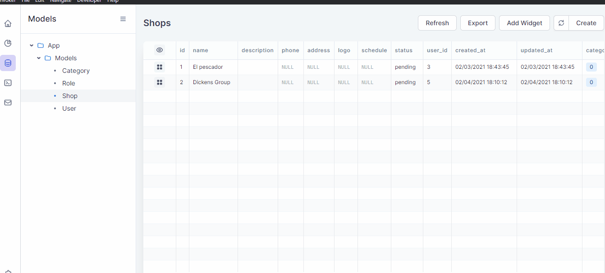

# Invoker Plugin Model Factory

### Plugin that allows you to run your model factories directly in Invoker.

## Installation

- Download the zip file in the releases section.
- Open your Invoker app.
- Now open the plugins page in Invoker
- Load the zip file by pressing the "Load from disk" button.
- Restart Invoker app.

## Local Installation

Create a folder on the root of your Laravel application invoker/plugins and clone the repository into that folder.

`git clone git@github.com:zarate-systems/invoker-plugin-model-factory.git`

- Install the npm dependencies.

`npm install`

- Generate the production files.

`npm run prod`

Enjoy :sparkles:

## Roadmap
- Add feature Overriding Attributes
- Add feature to apply factory states
- Add feature to indicate how many model factories you want to generate

## Contributing

Pull requests are welcome. For major changes, please open an issue first to discuss what you would like to change.
